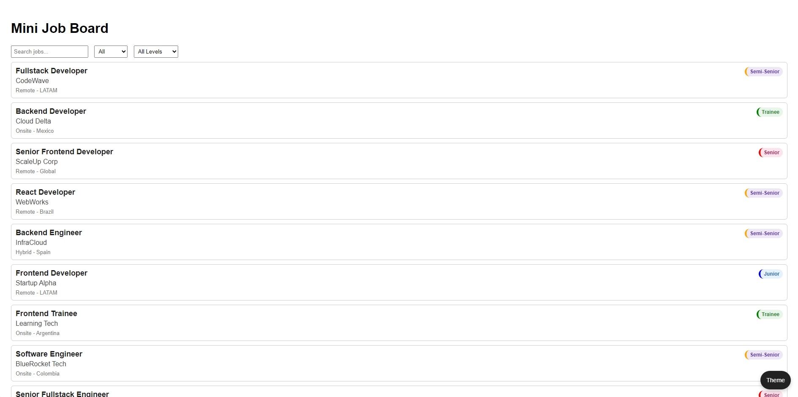
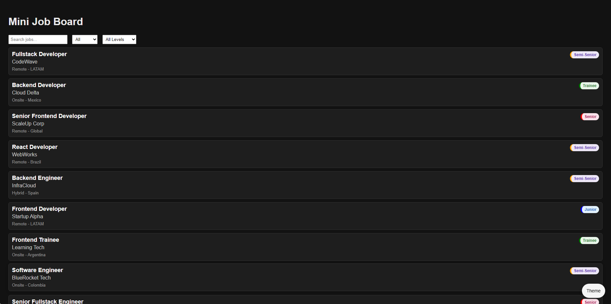

# Mini Job Board

A lightweight frontend project that simulates a real job board.

## Features

- Jobs loaded dynamically from JSON
- Real-time search
- Filter by job type and seniority
- Empty state handling
- Dark mode with persistence
- Responsive UI

## Tech stack

- HTML
- CSS
- Vanilla JavaScript

## How to run locally

1. Clone the repo
2. Open `index.html` with Live Server

## Screenshot

Add the two files above to ssets/screenshots/ before publishing.