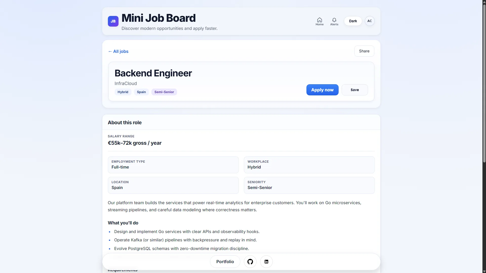
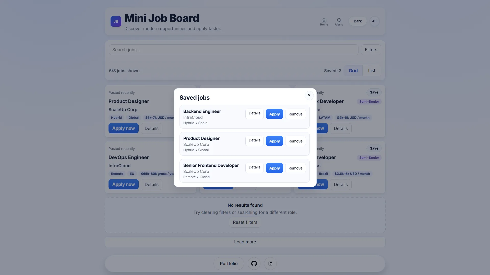
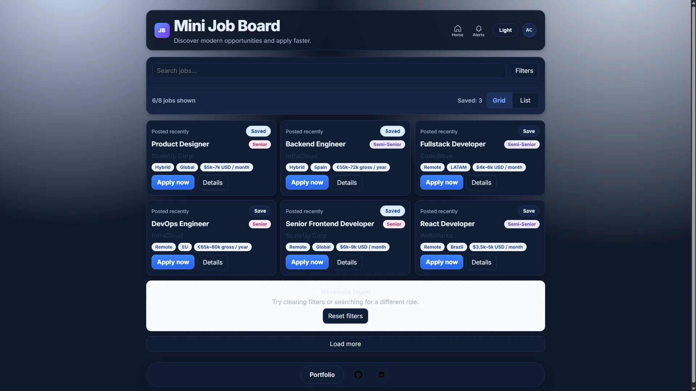

# Mini Job Board

[](.github/workflows/ci.yml) [](https://alejosworkstuff.github.io/mini-job-board/)

Vanilla JavaScript job board with real product behavior: search, multi-filter, sorting, saved jobs, detail pages, and persisted UI prefs. No framework and no build step for the UI. Built to show DOM/state depth with tests and CI.

**Live:** [alejosworkstuff.github.io/mini-job-board](https://alejosworkstuff.github.io/mini-job-board/)

## Screenshots

| Job listing | Job details | Saved jobs | Dark mode |
|:---:|:---:|:---:|:---:|
|  |  |  |  |

## What it shows

- Real-time search across title, company, and location
- Multi-filter (job type, seniority, salary) with URL state
- Sorting, load-more pagination, empty states
- Saved jobs (modal + dedicated page) and apply tracking in `localStorage`
- Job detail modal on the listing plus full `job-details.html`
- Dark mode and grid/list toggles with persistence
- Pure filter/sort module under test (`scripts/filter-logic.mjs`)
- CI: syntax checks, JSON data validation, unit tests, Playwright E2E

## Stack

- HTML, CSS, vanilla JavaScript
- Node.js for validation and unit tests
- Playwright + GitHub Actions

## Run locally

```bash
git clone https://github.com/alejosworkstuff/mini-job-board.git
cd mini-job-board
npm install
npm run ci
```

Serve the folder with any static server (needed for `fetch` of `data/jobs.json`). Then:

```bash
npm run test:e2e    # Playwright
npm run ci:full     # syntax + data + unit + E2E
```

## Technical choices

- **Vanilla JS**: DOM, events, and state without a framework
- **JSON data source**: fast demo without a backend
- **Shared filter module**: logic tested independently of the UI
- **localStorage**: theme, view mode, saved jobs, apply state

## License

MIT
