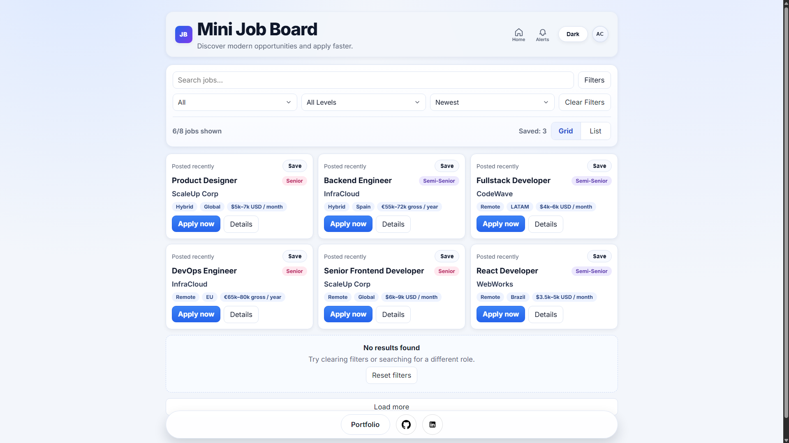
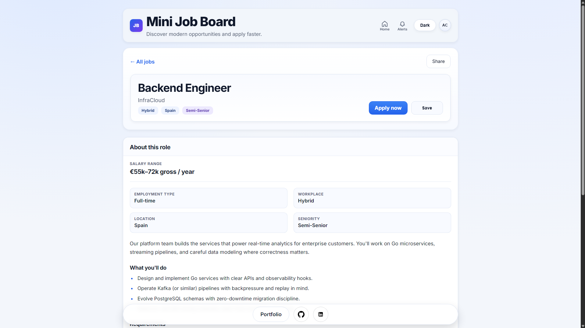
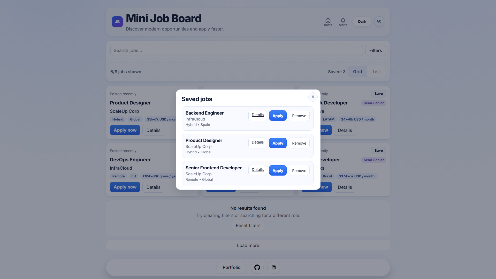
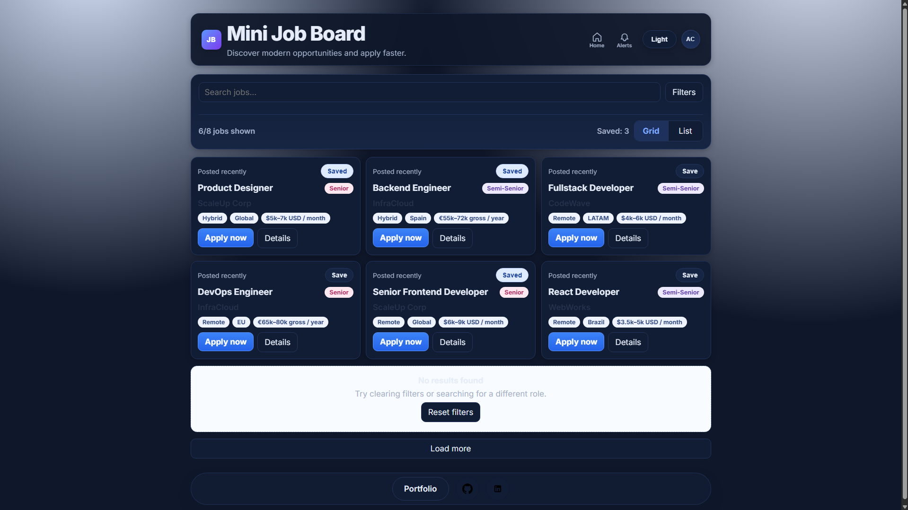

# Mini Job Board

A frontend job board built with vanilla JavaScript that simulates hiring-platform workflows: search, multi-filter, sorting, saved jobs, job modals, detail pages, and persisted UI preferences (theme and grid/list view).

This project is part of my portfolio focus on production-style frontend engineering without framework abstractions.

**Live:** [alejosworkstuff.github.io/mini-job-board](https://alejosworkstuff.github.io/mini-job-board/)  
**Repo:** [github.com/alejosworkstuff/mini-job-board](https://github.com/alejosworkstuff/mini-job-board)

## Screenshots

| Job listing | Job details | Saved jobs | Dark mode |
|:---:|:---:|:---:|:---:|
|  |  |  |  |

---

## Problem and Context

Most junior frontend demos only show static UIs. I wanted interaction-heavy product behavior: dynamic rendering, combined filters, persistence, empty states, and multi-page flows without React or a build step.

## My Role

- Designed and implemented the full frontend architecture
- Built filter/search/sort logic in shared modules (`scripts/filter-logic.mjs`)
- Implemented saved jobs, modals, detail pages, and header/menu UX
- Added automated tests for filter logic and CI for syntax + data validation

## Architecture Overview

```text
mini-job-board/
├── index.html           # Main listing page
├── job-details.html     # Full job detail page
├── saved-jobs.html      # Saved jobs page
├── app.js               # Listing: search, filters, sort, pagination, modals
├── job-details.js       # Detail page logic
├── saved-jobs.js        # Saved jobs page logic
├── site-header.js       # Shared header (theme, menu) on secondary pages
├── styles.css           # Layout, dark mode, modals, responsive rules
├── data/jobs.json       # Job records (local data source)
├── scripts/
│   ├── filter-logic.mjs      # Pure filter/sort helpers (tested)
│   └── validate-jobs.mjs     # JSON schema validation for CI
├── tests/
│   └── filter-logic.test.mjs # Node test runner
└── .github/workflows/ci.yml
```

### Data Flow

1. Load `data/jobs.json`
2. Keep source data in memory
3. Apply search text, type/seniority filters, and sort order
4. Render jobs (grid or list) with optional “load more” batching
5. Persist theme, view mode, and saved job IDs in `localStorage`

---

## Key Features

- Real-time search across title, company, and location
- Multi-filter controls (job type, seniority) with active-filter badge
- Sorting (e.g. newest, title, company)
- **Saved jobs** with count, modal list, and dedicated `saved-jobs.html` page
- **Job detail modal** on the listing page plus full **job-details.html**
- Empty-state handling with quick reset
- **Dark mode** toggle with `localStorage` persistence
- **Grid / list** view toggle with persistence
- Collapsible filters panel on smaller viewports
- Toast notifications and lightweight user menu (demo UX)
- Responsive layout and fixed footer with portfolio/GitHub links

## Technical Decisions and Tradeoffs

- **Vanilla JS first** — proves DOM, events, and state without framework abstractions.
- **JSON data source** — fast iteration; no backend required for the demo.
- **Shared filter module** — logic is testable independently of the DOM.
- **localStorage** — device-local persistence; no user accounts.
- **Static hosting** — ideal for GitHub Pages; clear path to a real API later.

---

## Tech Stack

- HTML5, CSS3
- Vanilla JavaScript (ES modules in tests; classic scripts in pages)
- Node.js (syntax checks, data validation, tests)
- GitHub Actions (CI)

---

## CI / Quality Baseline

GitHub Actions (`.github/workflows/ci.yml`) on pull requests and pushes to `main`:

- JavaScript syntax checks (`npm run check:syntax`) for `app.js`, `job-details.js`, `saved-jobs.js`, `site-header.js`
- Data validation (`npm run check:data`) — required fields, unique IDs, non-empty arrays in `data/jobs.json`
- Unit tests (`npm run test`) — `tests/filter-logic.test.mjs` via `node --test`

Run locally:

```bash
npm install
npm run ci
```

### npm Scripts

| Script | Command |
|--------|---------|
| `check:syntax` | `node --check` on core JS files |
| `check:data` | `node scripts/validate-jobs.mjs` |
| `test` | `node --test tests/*.mjs` |
| `ci` | All of the above |

---

## Local Setup

```bash
git clone https://github.com/alejosworkstuff/mini-job-board.git
cd mini-job-board
npm install
npm run ci
```

Open `index.html` with Live Server or any static file server (recommended over `file://` for `fetch` of `data/jobs.json`).

---

## Pages

| File | Purpose |
|------|---------|
| `index.html` | Job listing, filters, modals, save/unsave |
| `job-details.html` | Full detail view for one job (`?id=`) |
| `saved-jobs.html` | List of saved jobs |

---

## Case Study Highlights (Portfolio Use)

- **Challenge:** Combine search, filters, sorting, and persistence without framework state tools.
- **Approach:** Pure filter functions + in-memory source of truth; UI derives from filtered slices.
- **Result:** Interaction-heavy UI with tested filter logic and CI-backed data integrity.

## What I Would Improve Next

- Backend API with server-side filtering and pagination
- Broader automated tests (DOM/integration or Playwright)
- Accessibility audit and targeted fixes
- Deployment previews and release notes in CI

## License

MIT
